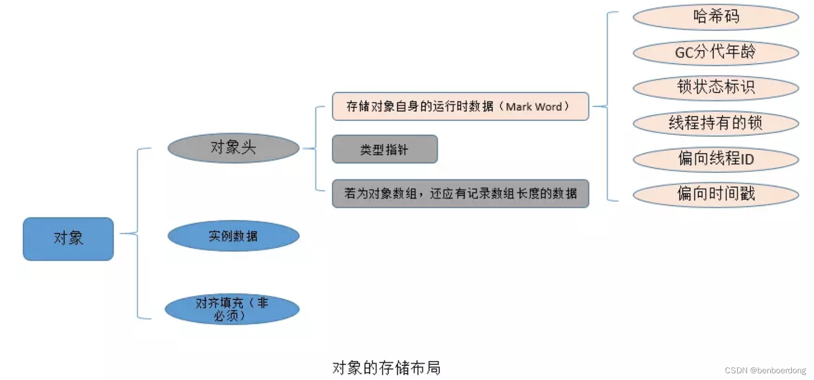
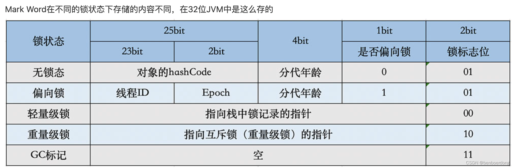
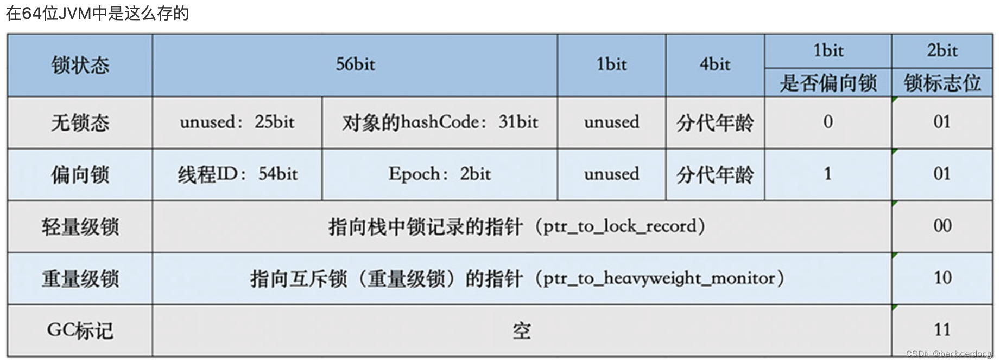

# Java对象

> 📌 **关键词：** java、内存

## 对象构成

* 对象头
    * Mark Word: 对象运行时数据，动态定义位数据。包含 HashCode、GC 分代年龄、锁状态标志、线程持有的锁、偏向线程 ID、偏向时间戳等。32 位和 64 位的 VM 里 Mark Word 的长度分别 32 bit 和 64 bit。
    * Class Pointer: 类型指针，存储一个地址，长度取决于系统位数.对象指向所属 class 的元数据的指针，32 位 VM 4 byte，64 位 VM 8 byte(-XX:+UseCompressedOops 压缩指针 4 byte)。非必需，取决 JVM 实现。
    * 若为数组对象，包含长度信息，4 byte。
> 非数组对象为2个机器码，数组对象为3个机器码
* 实例数据
    * 1 bit: boolean
    * 1 byte: byte
    * 2 byte: short|char
    * 4 byte: int|float|oops(Ordinary Object Pointers)
    * 8 byte: long|double
* 对齐填充
    * 非必需，保证对象大小是 8 字节的整数倍进行填充的长度。
    * 仅占位


## 对象头

### Mark Word

* Mark Word
  * 锁信息
  * GC信息
  * hash码




在不同位数的JVM中长度不一样，但是基本组成内容是一致的。

* 锁标志位（lock）：区分锁状态，11时表示对象待GC回收状态, 只有最后2位锁标识(11)有效。
* biased_lock：是否偏向锁，由于无锁和偏向锁的锁标识都是 01，没办法区分，这里引入一位的偏向锁标识位。
* 分代年龄（age）：表示对象被GC的次数，当该次数到达阈值的时候，对象就会转移到老年代。
* 对象的hashcode（hash）：运行期间调用System.identityHashCode()来计算，延迟计算，并把结果赋值到这里。当对象加锁后，计算的结果31位不够表示，在偏向锁，轻量锁，重量锁，hashcode会被转移到Monitor中。
* 偏向锁的线程ID（JavaThread）：偏向模式的时候，当某个线程持有对象的时候，对象这里就会被置为该线程的ID。 在后面的操作中，就无需再进行尝试获取锁的动作。
* epoch：偏向锁在CAS锁操作过程中，偏向性标识，表示对象更偏向哪个锁。
* ptr_to_lock_record：轻量级锁状态下，指向栈中锁记录的指针。当锁获取是无竞争的时，JVM使用原子操作而不是OS互斥。这种技术称为轻量级锁定。在轻量级锁定的情况下，JVM通过CAS操作在对象的标题字中设置指向锁记录的指针。
* ptr_to_heavyweight_monitor：重量级锁状态下，指向对象监视器Monitor的指针。如果两个不同的线程同时在同一个对象上竞争，则必须将轻量级锁定升级到Monitor以管理等待的线程。在重量级锁定的情况下，JVM在对象的ptr_to_heavyweight_monitor设置指向Monitor的指针。

### Class Pointer

类型指针，是对象指向它的类元数据的指针，虚拟机通过这个指针来确定这个对象是哪个类的实例。

### 实例数据

对象有属性字段，则会有数据信息，无属性字段则无数据信息。

## 数据对齐

数据对齐非必须。默认情况下，Java虚拟机堆中对象的起始地址需要对齐至8的倍数。如果一个对象用不到8N个字节则需要对其填充，以此来补齐对象头和实例数据占用内存之后剩余的空间大小。如果对象头和实例数据已经占满了JVM所分配的内存空间，那么就不用再进行对齐填充了。

### 原因

字段内存对齐其中的一个原因，是让字段只出现在同一CPU的缓存行中。如果字段不是对齐的，那么就有可能出现跨缓存行的字段。也就是说，该字段的读取可能需要替换两个缓存行，而该字段的存储也会同时污染两个缓存行。这两种情况对程序的执行效率而言都是不利的。对齐填充最终目的是为了计算机高效寻址。


### 对象分析

#### Maven引入jol-core
```java

	<!-- 分析对象布局 -->
		<dependency>
			<groupId>org.openjdk.jol</groupId>
			<artifactId>jol-core</artifactId>
			<version>0.10</version>
		</dependency>
```

#### 使用
```java

public static void main(String[] args) {
        System.out.println("对象内部信息");
        System.out.println(ClassLayout.parseInstance(new String("test")).toPrintable());
        System.out.println(ClassLayout.parseInstance(new char[]{'t', 'e', 's', 't'}).toPrintable());

        System.out.println("对象整体信息");
        System.out.println(GraphLayout.parseInstance(new String("test")).toPrintable());
        System.out.println(GraphLayout.parseInstance(new char[]{'t', 'e', 's', 't'}).toPrintable());

        System.out.println("对象占用总空间");
        System.out.println(GraphLayout.parseInstance(new String("test")).totalSize());
        System.out.println(GraphLayout.parseInstance(new char[]{'t', 'e', 's', 't'}).totalSize());
    }

```


#### JProfiler

用于分析正在运行的JVM内部发生的情况。


