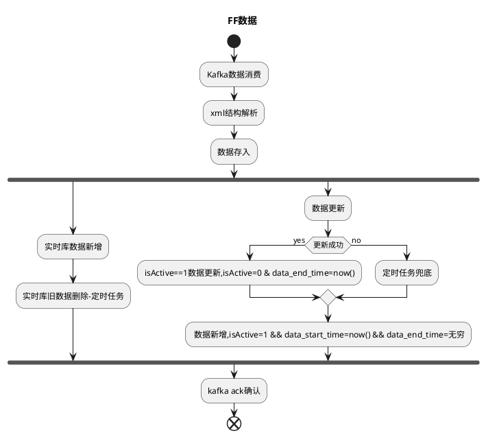

# FF数据落地
## 需求
* Kafka原始数据解析
* FF数据存储到对应的FF_history库 & FF实时库
    * FF实时库保留最新一批数据，通过定时任务进行物理删除旧数据
    * FF_History库保留所有FF数据
* 基于落地数据，封装接口使用
    * 实时FF全量输出
    * 历史FF根据数据有效期过滤输出，表达出历史某一时刻的数据视图
* 定时任务

上线需要交易推送数据

## 方案
交易每次数据更新会将全量数据通过Kafka推送

在库中增加两个字段data_start_time和data_end_time （数据接收时间）
* 实时库
    * 数据更新
        * update数据
            * isActive==1的数据置为0 && data_end_time=now()
        * insert数据
            * 数据库插入数据并设isActive=1 && data_start_time=now() && data_end_time=无穷
    * 定时任务物理删除isActive=0的数据
* 历史库
    * 数据更新
        * update数据
            * max(dataCreateTime)的数据data_end_time=now()
        * insert数据
            * 数据库插入数据并设isActive=1 && data_start_time=now() && data_end_time=无穷

同步方法更新

* 问题
    * 实时库旧数据删除
        * 每日定时删除实时库中isActive=0数据

    * Kafka数据消费异常
        * 间隔重试机制

