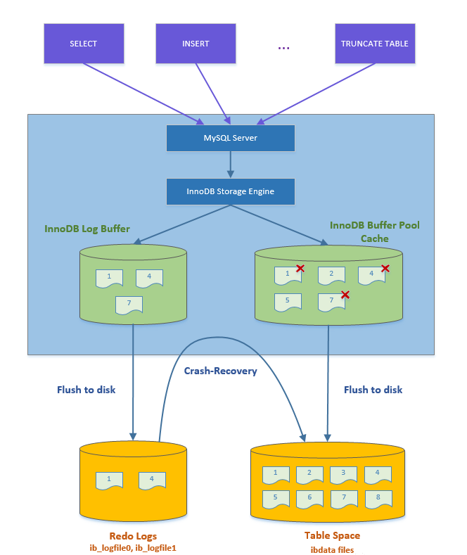

# mysql-buffer pool

> 📌 **关键词：** mysql、buffer pool

转~https://cloud.tencent.com/developer/article/2123140

## 什么是Buffer Pool

* 在应用系统中，为了加速对数据的访问，通常将高频数据放入**缓存**中（Redis、MongoDB）,减轻数据库压力
* 在操作系统中，为了减少磁盘I/O，引入了**缓冲池**机制
* Mysql作为存储系统，为了提高性能，减少磁盘I/O，同样具有**缓冲池**机制。


「上述结构图中展示了Buffer Pool作为InnoDB内存结构的四大组件之一，不属于MySQL的Server层，是InnoDB存储引擎层的缓冲池」。因此这个跟MySQL8.0删掉的【查询缓存】功能是不一样的。


**Buffer Pool即缓冲池简称BP，BP以Page页为单位，缓存最热数据页（data page）与索引页（index page）。Page页默认大小16K，底层由链表管理**




所有数据页读写操作都通过Buffer Pool进行

* innodb读操作，先从buffer pool中查看数据的数据页是否存在，如果不存在，则将page从磁盘读取到buffer pool中
* innodb写操作，先把数据和日志写入buffer pool 和 log buffer, 由后台线程以一定频率将buffer中的内容刷到磁盘，这个刷盘机制叫做**checkpoint**

写操作的事务持久性由redo log 落盘保证，buffer pool只是为了提高读写效率。

---


「Buffer Pool缓存表数据与索引数据，把磁盘上的数据加载到缓冲池，避免每次访问都进行磁盘IO，起到加速访问的作用」。

Buffer Pool是一块内存区域，是一种「降低磁盘访问的机制」。

数据库的读写都是在buffer pool上进行，和undo log/redo log/redo log buffer/binlog一起使用，后续会把数据刷到硬盘上。

Buffer Pool默认大小 128M，用于缓存数据页（16KB）。
```
show variables like 'innodb_buffer%';
```

---
Buffer Pool 是 innodb的数据缓存， 除了缓存「索引页」和「数据页」，还包括了 undo 页，插入缓存、自适应哈希索引、锁信息等。

「buffer pool绝大多数page都是 data page（包括index page）」。

「innodb 还有日志缓存 log buffer，保存redo log」。

---

## Buffer Pool组成

Buffer Pool中缓存的是数据页，数据页大小跟磁盘默认数据页大小一样（16K），为了更好管理的缓存页，Buffer Pool有一个「描述数据的区域」 ：

**「InnoDB 为每一个缓存的数据页都创建了一个单独的区域，记录的数据页的元数据信息，包括数据页所属表空间、数据页编号、缓存页在Buffer Pool中的地址，链表节点信息、一些锁信息以及 LSN 信息等，这个区域被称之为控制块」。**

**「控制块和缓存页是一一对应的，它们都被存放到 Buffer Pool 中，其中控制块被存放到 Buffer Pool 的前边，缓存页被存放到 Buffer Pool 后边」，**

控制块大概占缓存页大小的5%，16 * 1024 * 0.05 = 819个字节左右。

---


上图展示了控制块与数据页的对应关系，可以看到在控制块和数据页之间有一个**碎片空间。**

数据页大小为16KB，控制块大概为800字节，当我们划分好所有的控制块与数据页后，可能会有剩余的空间不够一对控制块和缓存页的大小，这部分就是多余的碎片空间。如果把 Buffer Pool 的大小设置的刚刚好的话，也可能不会产生碎片。


## 三、Buffer Pool 管理

**「Buffer Pool里有三个链表，LRU链表，free链表，flush链表，InnoDB正是通过这三个链表的使用来控制数据页的更新与淘汰的」。**

### 3.1 Buffer Pool 初始化

**「当启动 Mysql 服务器的时候，需要完成对 Buffer Pool 的初始化过程，即分配 Buffer Pool 的内存空间，把它划分为若干对控制块和缓存页」。**

* **「申请空间」**

    Mysql 服务器启动，就会根据设置的Buffer Pool大小（innodb_buffer_pool_size）超出一些，去操作系统「**申请一块连续内存区域」**作为Buffer Pool的内存区域。
    这里之所以申请的内存空间会比innodb_buffer_pool_size大一些，主要是因为里面还要存放每个缓存页的控制块。

* **「划分空间」**

    当内存区域申请完毕之后，数据库就会按照默认的缓存页的16KB的大小以及对应的800个字节左右的控制块的大小，在Buffer Pool中划分「成若干个【控制块&缓冲页】对」。


划分空间后Buffer Pool的缓存页是都是空的，里面什么都没有，当要对数据执行增删改查的操作的时候，才会把数据对应的页从磁盘文件里读取出来，放入Buffer Pool中的缓存页中。


### 3.2 Free链表

### LRU链表

### Flush链表


## 刷盘机制


## mysql对LRU算法优化


## 多实例BUffer Pool
