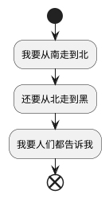
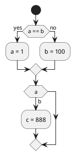

# plantUML
## 介绍
    通过简单的文本描述，在线绘制图形的开源工具。
    官网：https://plantuml.com/zh/

## 安装
https://blog.csdn.net/qq_40734247/article/details/133847249

## 流程图

1. 开始和结束

```plantuml
@startuml
start
end
@enduml

```

2. 流程框

```plantuml
@startuml
start
:我要从南走到北;
:还要从北走到黑;
:我要人们都告诉我;
end
@enduml

```

3. 条件判断

if-else两种形式

```plantuml
@startuml
start
if (a == b) then (yes)
    :a = 1;
else(no)
    :b = 100;
endif


if(a) equals (b) then
    :c = 888;


```

