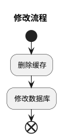
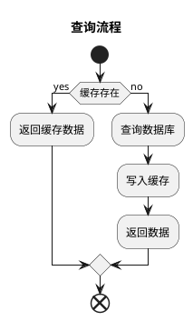
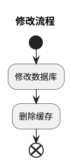

# redis实战问题
## 缓存穿透
### 问题
查询一个不存在的数据，即在缓存中和数据库中同时不存在

### 解决
1. 在逻辑代码中对已知存储数据范围之外的查询做拦截，当数据库中已知存储>0的数据，可对<0的数据做拦截。这种方式只能拦截部分请求
2. 使用布隆过滤器，布隆过滤器不存在的数据一定不存在，存在的数据可能存在
3. 将不存在的key存储在缓存中，设置过期时间

## 缓存击穿
### 问题
数据库中有，缓存中没有。高并发场景下，一般先查询缓存，缓存没有则查询数据库获取。当缓存过期后，大批量请求直接透过缓存查询数据库，造成数据库负载过大。

### 解决
1. 加锁。单机部署可以使用JVM级别的锁，如lock，synchronized。集群部署的时候可以使用分布式锁，redis/mysql实现的锁。

## 缓存雪崩
### 问题
同一时间，缓存中大量的key失效，导致大量请求直接访问数据库造成服务压力过大，宕机，崩溃。

### 解决
1. 缓存数据过期时间随机，防止同一时间大量数据过期
2. 使用集群，将热点数据分布在不同的缓存库中
3. 热点数据不过期

## 数据不一致
### 问题
数据库更新数据的时候，导致数据库数据和缓存中数据不一致。

### 解决
保证的是数据的最终一致性而不是实时一致性

1. 先删缓存，后改数据库

    并发场景下，A线程修改数据库完成之前，B线程已经写入缓存，最终造成数据不一致情况。
    解决：延时双删策略
        修改流程：删除缓存 -> 修改数据库 -> 延时删除缓存
        延时大小通过B线程写入缓存时间进行评估，但是依然有小概率情况（B线程服务fullGC）导致数据不一致。
        同时每个写请求都延时的情况造成性能下降
    
2. 先改数据库，后删缓存

    并发场景下，A线程删除缓存失败，导致其他线程读取的依然是旧数据，造成数据不一致。
    删除失败时，可以采用重试机制 or MQ机制进行删除重试逻辑

    上面的场景中最终都会删除缓存，将删除逻辑进行解耦使用阿里的cannel组件。

3. 读写锁，对读操作加读锁，对写操作加写锁，读锁是非互斥的，一个请求获得读锁的时候另一个线程也可以得到读锁。写锁是互斥的，一个线程在获得写锁时，另一个线程既不能读也不能写。

读写锁可以使用redisson实现，源码里是通过lua脚步实现的，之所以读锁与读锁不互斥，写锁与读锁互斥，写锁与写锁互斥是因为它里面的lua脚步里面设置一个模式---mode，读锁时的mode为read，写锁时的mode为write，
用这个模式来判断能否再加锁也就是能否互斥。这种方案适合于读多写少的场景，因为写锁互斥会有性能问题，写的场景少的时候互斥的情况就少，这时可以采用读写锁。

## 分布式锁
在分布式应用中，并发问题的处理依靠应用JVM级别的锁是无法处理的。这时需要使用分布式锁来限制程序的并发执行。

### 超时问题
Redis 的分布式锁不能解决超时问题，如果在加锁和释放锁之间的逻辑执行的太长，以至于超出了锁的超时限制，就会出现问题。因为这时候锁过期了，第二个线程重新持有了这把锁，
但是紧接着第一个线程执行完了业务逻辑，就把锁给释放了，第三个线程就会在第二个线程逻辑执行完之间拿到了锁。

* 使用Lua脚本将加锁与释放锁形成原子性

### 多客户端同时持有锁
* 场景:
    * 业务逻辑执行时间超出锁的超时限制导致两个客户端同时持有锁
        * 在解锁和释放锁之间的逻辑执行时间太长，超出了锁的超时限制。因为这时候第一个线程持有的锁过期了，临界区的逻辑还没有执行完，这个时候第二个线程就提前重新持有了这把锁，导致临界区代码不能得到严格的串行执行。
    * redis的单点故障主从切换
        * 生产中redis一般是主从模式，主节点挂掉时，从节点会取而代之，客户端上却并没有明显感知。原先第一个客户端在主节点中申请成功了一把锁，但是这把锁还没有来得及同步到从节点，主节点突然挂掉了。然后从节点变成了主节点，这个新的节点内部没有这个锁，所以当另一个客户端过来请求加锁时，立即就批准了。这样就会导致系统中同样一把锁被两个客户端同时持有，不安全性由此产生。不过这种不安全也仅仅是在主从发生 failover 的情况下才会产生，而且持续时间极短。

**解决：
1.调大锁的超时时间  
2.执行计算期间发现锁快要超时了，，客户端可以给redis服务实例发送一个Lua脚本让redis服务端延长锁的时间，只要这个锁的key还存在而且值还等于客户端设置的那个值。 客户端应当只有在失效时间内无法延长锁时再去重新获取锁（基本上这个和获取锁的算法是差不多的）。**

