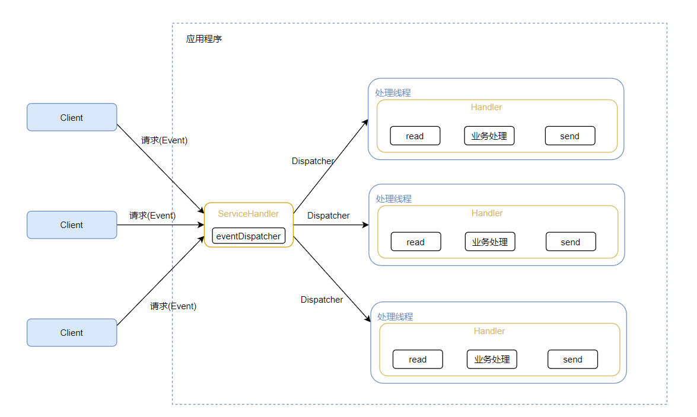

#---
icon: pen-to-square
date: 2024-01-19 11:30
category:
  - 模式
tag:
  - reactor
---

# ractor模式？
目前存在的线程模型主要有：
* 传统阻塞I/O服务模型
* Reactor模式

## 传统阻塞I/O服务模型
 

### 模型特点
 * 采用阻塞IO模式获取输入的数据
 * 每个链接都需要独立线程完成数据的输入、业务处理、数据返回
### 问题
 * 并发数很大时，会创建大量线程，占用很大系统资源。
 * 连接创建后，当前线程暂时没有数据可读，该线程会阻塞在read操作，造成线程资源浪费

 ## Reactor模式

针对传统I/O服务模型缺点，解决方案：
* 异步非阻塞：Reactor模式使用异步非阻塞的方式进行I/O操作。当一个I/O操作需要等待数据读取或写入时，线程不会被阻塞，而是继续处理其他任务。这样可以大大提高系统的并发处理能力和响应性能。

* 事件驱动：Reactor模式使用事件驱动的方式处理I/O操作。当一个I/O事件发生时，Reactor会接收事件并将其分派给相应的处理器进行处理。这种事件驱动的方式极大地简化了I/O操作的处理逻辑，并提高了系统的可维护性和可扩展性。

* 单线程或少量线程：Reactor模式通常使用单线程或少量线程来处理所有的I/O事件。这样可以减少线程的切换开销和线程资源的消耗，提高系统的性能和资源利用率。

* 可伸缩性：Reactor模式通过使用事件驱动和异步非阻塞的方式，可以实现高并发连接的处理。它可以通过线程池或者事件循环机制来处理大量的并发连接，提高系统的可伸缩性。

##### Reactor模式中的核心组成部分

* Reactor：Reactor在一个单独的线程中运行，负责监听和分发事件，分发给适当的处理程序来对IO事件作出反应。即上图的ServiceHandler

* Handlers：处理程序执行I/O事件要完成的实际事件，Reactor通过调度适当的处理程序来响应I/O事件，处理程序执行非阻塞操作。

### 单Reactor单线程

* Select 是前面 I/O 复用模型介绍的标准网络编程 API，可以实现应用程序通过一个阻塞对象监听多路连接请求
* Reactor 对象通过 Select 监控客户端请求事件，收到事件后通过 Dispatch 进行分发
* 如果是建立连接请求事件，则由 Acceptor 通过 Accept 处理连接请求，然后创建一个 Handler 对象处理连接完成后的后续业务处理
* 如果不是建立连接事件，则 Reactor 会分发调用连接对应的 Handler 来响应
* Handler 会完成 Read→业务处理→Send 的完整业务流程

### 单Reactor多线程

* Reactor 对象通过select 监控客户端请求事件, 收到事件后，通过dispatch进行分发
* 如果建立连接请求, 则右Acceptor 通过accept 处理连接请求, 然后创建一个Handler对象处理完成连接后的各种事件
* 如果不是连接请求，则由reactor分发调用连接对应的handler 来处理
  handler 只负责响应事件，不做具体的业务处理, 通过read 读取数据后，会分发给后面的worker线程池的某个线程处理业务
* worker 线程池会分配独立线程完成真正的业务，并将结果返回给handler
  handler收到响应后，通过send 将结果返回给client

优点：可以充分的利用多核cpu 的处理能力
缺点：多线程数据共享和访问比较复杂， reactor 处理所有的事件的监听和响应，在单线程运行， 在高并发场景容易出现性能瓶颈.

### 多Reactor多线程

* Reactor主线程 MainReactor 对象就只注册一个用于监听连接请求的ServerSocketChannel，通过select 监听连接事件, 收到事件后，通过Acceptor 处理连接事件
* 当 Acceptor 处理连接事件后，MainReactor 通过accept获取新的连接，并将连接注册到SubReactor
* subreactor 将连接加入到连接队列进行监听,并创建handler进行各种事件处理
* 当有新事件发生时， subreactor 就会调用对应的handler处理
* handler 通过read 读取数据，分发给后面的worker 线程处理
* worker 线程池分配独立的worker 线程进行业务处理，并返回结果
* handler 收到响应的结果后，再通过send 将结果返回给client
* Reactor 主线程当然是可以对应多个Reactor 子线程的，这也就解决了并发的问题

优点：
* 父线程与子线程的数据交互简单职责明确，父线程只需要接收新连接，子线程完成后续的业务处理。
* 父线程与子线程的数据交互简单，Reactor 主线程只需要把新连接传给子线程，子线程无需返回数据
缺点：编程复杂度较高
Netty就是基于此模型的

>> https://www.cnblogs.com/sjkzy/p/16413205.html