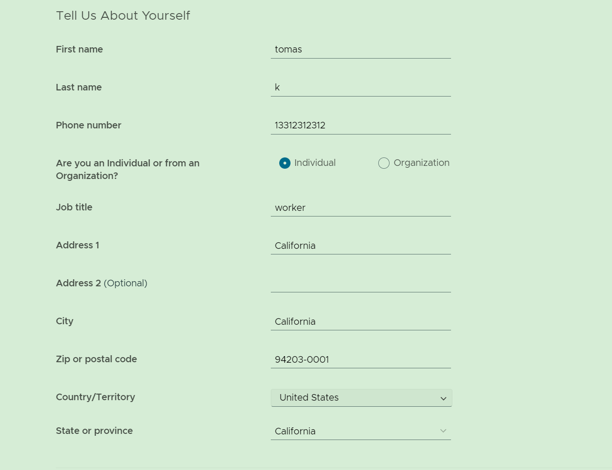

# windows下安装vmware

> 📌 **关键词：** vmware安装


## 下载路径

* vmware

 https://customerconnect.vmware.com/cn/downloads/info/slug/desktop_end_user_computing/vmware_workstation_pro/16_0

 这里下载需要注册vmware用户：


 ```
【地区】我填的是 “tomas”。
【名字】【姓氏】按情况填写。
【手机】“代码块”可不用操作，手机我填的是  13312312312
【邮箱】电子邮箱必须要真实，因为会给你发激活链接

** 输入验证码的时候 ** 需要将浏览器语言切换成英文，中文模式会有问题


 ```


## DLL未安装

安装过程报错：


* 不要关闭上面截图对话框（不要点击确定）
* win + R 快捷键 然后输入 %temp%  
* 找到末尾为 ~setup的文件夹

* 点击VMwareWorkstation.msi 完成安装 
* 点击了VMwareWorkstation.msi  出现了安装界面，将报错界面点击确定关闭

错误分析：
查看VMware 的日志文件（temp目录下的）vminst.log 文件 

## 安装

* 安装位置修改


* vmware发生无误，安装提前结束

问题很奇怪，上午尝试了15-17的版本，全部提前结束。下午尝试了14无问题，重新下载16版本正常安装。
可重启电脑尝试

## 序列号

```
ZF3R0-FHED2-M80TY-8QYGC-NPKYF

YF390-0HF8P-M81RQ-2DXQE-M2UT6

ZF71R-DMX85-08DQY-8YMNC-PPHV8

使用第一个激活成功

```


